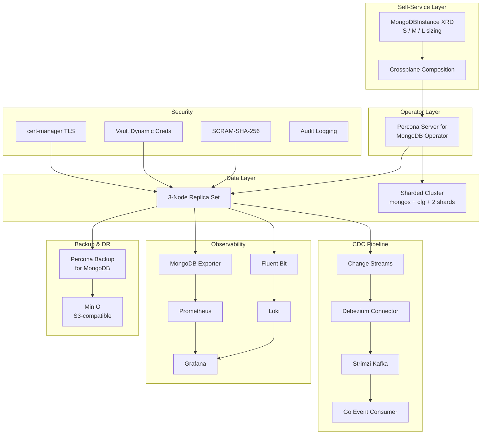

# mongodb-k8s-dbaas-platform

[](https://github.com/Vedric/mongodb-k8s-dbaas-platform/actions/workflows/lint.yaml)
[](https://github.com/Vedric/mongodb-k8s-dbaas-platform/actions/workflows/test.yaml)
[](LICENSE)

Enterprise-grade, self-service Database-as-a-Service (DBaaS) platform for MongoDB on Kubernetes. Provides production-ready stateful workload management including HA replica sets, sharded clusters, automated backups with PITR, full observability, CDC pipelines, multi-tenancy, and chaos-tested disaster recovery.

## Architecture



## Key Features

- **HA Replica Sets** - 3-node replica sets with automated failover, managed by Percona Operator
- **Sharded Clusters** - Full sharding topology (mongos, config servers, multiple shards)
- **Self-Service Provisioning** - Crossplane XRD with t-shirt sizing (S/M/L) for product teams
- **Multi-Tenancy** - Namespace isolation with NetworkPolicies, ResourceQuotas, and LimitRanges
- **Automated Backups** - Daily snapshots + continuous oplog via PBM to S3-compatible storage
- **Point-in-Time Recovery** - PITR with validated restore procedures and integrity checks
- **Full Observability** - Prometheus metrics, Grafana dashboards, Fluent Bit + Loki log pipeline
- **Critical Alerting** - PrometheusRules for replication lag, oplog window, disk pressure, failover
- **CDC Pipeline** - MongoDB Change Streams via Debezium to Kafka with Go event consumer
- **Security Hardening** - TLS everywhere, SCRAM-SHA-256 auth, encryption at rest, audit logging
- **Vault Integration** - Dynamic credential rotation via HashiCorp Vault
- **Chaos Testing** - Primary kill, PV deletion, network partition with recovery validation

## Prerequisites

| Tool | Version | Purpose |
|------|---------|---------|
| `kind` | >= 0.20.0 | Local Kubernetes cluster |
| `kubectl` | >= 1.28 | Cluster management |
| `helm` | >= 3.13 | Chart deployment |
| `kustomize` | >= 5.0 | Manifest overlays |
| `jq` | >= 1.6 | JSON processing |
| `bats` | >= 1.10 | Test framework |
| `yamllint` | >= 1.33 | YAML validation |
| `shellcheck` | >= 0.9 | Shell script linting |
| `pre-commit` | >= 3.6 | Git hooks |

## Quick Start

```bash
# Clone the repository
git clone https://github.com/Vedric/mongodb-k8s-dbaas-platform.git
cd mongodb-k8s-dbaas-platform

# Bootstrap the full platform (kind cluster + operator + replica set)
make bootstrap

# Verify the replica set is healthy
make test

# Load sample data
make seed-data

# Access Grafana dashboards
make port-forward
# Grafana: http://localhost:3000
```

## Project Structure

```
mongodb-k8s-dbaas-platform/
├── operator/              # Percona Operator deployment (Kustomize)
├── clusters/
│   ├── replicaset/        # 3-node replica set CR + StorageClass
│   └── sharded/           # Sharded cluster CR (mongos + cfg + shards)
├── self-service/
│   ├── crossplane/        # XRD, Composition, example claims
│   └── tenancy/           # Namespace template, NetworkPolicy, quotas
├── backup/                # PBM config, schedules, MinIO, restore scripts
├── observability/
│   ├── prometheus/        # Exporter, ServiceMonitor, recording rules
│   ├── grafana/           # Dashboards (replication, WiredTiger, connections)
│   ├── logging/           # Fluent Bit + Loki pipeline
│   └── alerting/          # PrometheusRule CRs for critical alerts
├── security/
│   ├── tls/               # cert-manager certificates
│   ├── auth/              # SCRAM users, Vault integration
│   ├── encryption/        # Encryption at rest config
│   └── audit/             # Audit log configuration
├── cdc/
│   ├── kafka/             # Strimzi operator + cluster + topics
│   ├── debezium/          # MongoDB connector config
│   └── consumer/          # Go event consumer micro-service
├── tests/
│   ├── bats/              # Integration test suite
│   ├── chaos/             # Chaos engineering scripts
│   └── ci/                # CI-specific test helpers
├── scripts/               # Bootstrap, teardown, seed-data, port-forward
├── docs/
│   ├── architecture.md    # Detailed architecture documentation
│   ├── decisions/         # Architecture Decision Records (ADRs)
│   ├── runbook-*.md       # Operational runbooks
│   └── benchmarks/        # Storage benchmark results
└── Makefile               # Unified interface for all operations
```

## Usage

Product teams provision MongoDB instances via a simple Crossplane claim:

```yaml
apiVersion: dbaas.platform.io/v1alpha1
kind: MongoDBInstance
metadata:
  name: team-alpha-db
  namespace: team-alpha
spec:
  size: M              # S (2 CPU, 4Gi RAM, 20Gi disk)
                        # M (4 CPU, 8Gi RAM, 50Gi disk)
                        # L (8 CPU, 16Gi RAM, 100Gi disk)
  version: "7.0"
  backupEnabled: true
```

The platform automatically provisions:
- Dedicated namespace with network isolation
- MongoDB replica set sized according to the t-shirt profile
- Backup schedules (daily snapshot + continuous oplog)
- Monitoring integration (ServiceMonitor, dashboard)
- Resource quotas and limit ranges

## Observability

| Dashboard | Metrics |
|-----------|---------|
| Replication | Replication lag, oplog window, member states, election events |
| WiredTiger | Cache utilization, evictions, dirty pages, checkpoint duration |
| Connections | Active/available connections, per-client breakdown, pool saturation |
| Tenant Overview | Per-tenant resource consumption, request rates, storage usage |

Alerts fire on: replication lag > 10s, oplog window < 2h, disk > 80%, primary step-down, member down.

## Backup & Disaster Recovery

| Metric | Target |
|--------|--------|
| RPO | 15 minutes (continuous oplog backup) |
| RTO | 30 minutes (full restore + PITR replay) |

Backup strategy:
- **Daily snapshots** via PBM to MinIO (S3-compatible)
- **Continuous oplog** backup every 10 minutes for PITR granularity
- **Automated restore validation** in CI with `dbHash` integrity checks

See [runbook-backup-restore.md](docs/runbook-backup-restore.md) for procedures.

## Security

- **Encryption in transit**: TLS enforced on all replica set members and client connections (cert-manager)
- **Encryption at rest**: WiredTiger encryption with key management
- **Authentication**: SCRAM-SHA-256 with dynamic credential rotation via Vault
- **Audit logging**: All auth events, CRUD operations, and DDL changes captured
- **Network isolation**: NetworkPolicies enforce strict tenant boundaries

## Testing

```bash
make test          # Full bats test suite
make test-chaos    # Chaos engineering scenarios
make test-backup   # Backup/restore validation cycle
make lint          # yamllint + shellcheck + helm lint
```

Chaos scenarios covered:
- Primary pod deletion with failover validation
- PV loss with backup-based recovery
- Network partition between replica set members

## Architecture Decision Records

| ADR | Title | Status |
|-----|-------|--------|
| [ADR-001](docs/decisions/ADR-001-percona-vs-community-operator.md) | Percona vs Community Operator | Accepted |
| [ADR-002](docs/decisions/ADR-002-storage-class-selection.md) | Storage Class Selection | Accepted |
| [ADR-003](docs/decisions/ADR-003-crossplane-vs-argocd-appset.md) | Crossplane vs ArgoCD ApplicationSet | Accepted |
| [ADR-004](docs/decisions/ADR-004-backup-strategy-pbm.md) | Backup Strategy with PBM | Accepted |
| [ADR-005](docs/decisions/ADR-005-self-service-xrd-design.md) | Self-Service XRD Design | Accepted |
| [ADR-006](docs/decisions/ADR-006-cdc-debezium-vs-change-streams.md) | CDC: Debezium vs Change Streams | Accepted |
| [ADR-007](docs/decisions/ADR-007-chaos-testing-approach.md) | Chaos Testing Approach | Accepted |

## Cross-Project Integration

This platform integrates with a broader platform engineering portfolio:

| Project | Integration |
|---------|-------------|
| `vault-k8s-enterprise-secrets-platform` | Dynamic MongoDB credentials, auto-rotation |
| `consul-zero-trust-service-mesh` | mTLS between CDC consumer and Kafka |
| `terraform-azure-enterprise-landing-zone` | AKS infrastructure provisioning |
| `secure-cicd-platform` | Trivy scanning of CDC consumer image |
| `aws-eks-production-platform` | EKS deployment variant with EBS CSI tuning |

## Contributing

1. Branch from `develop` using the naming convention: `feat/<scope>-<desc>`, `fix/<scope>-<desc>`, `docs/<desc>`
2. Follow [Conventional Commits](https://www.conventionalcommits.org/) for commit messages
3. Ensure `make lint` passes
4. Submit PR to `develop` with passing CI

See the coding standards section in the project documentation for detailed conventions.

## License

This project is licensed under the Apache License 2.0. See [LICENSE](LICENSE) for details.
