# Architecture Overview

This document provides a detailed technical architecture of the mongodb-k8s-dbaas-platform, covering component topology, data flows, and integration patterns across all platform layers.

## High-Level Architecture

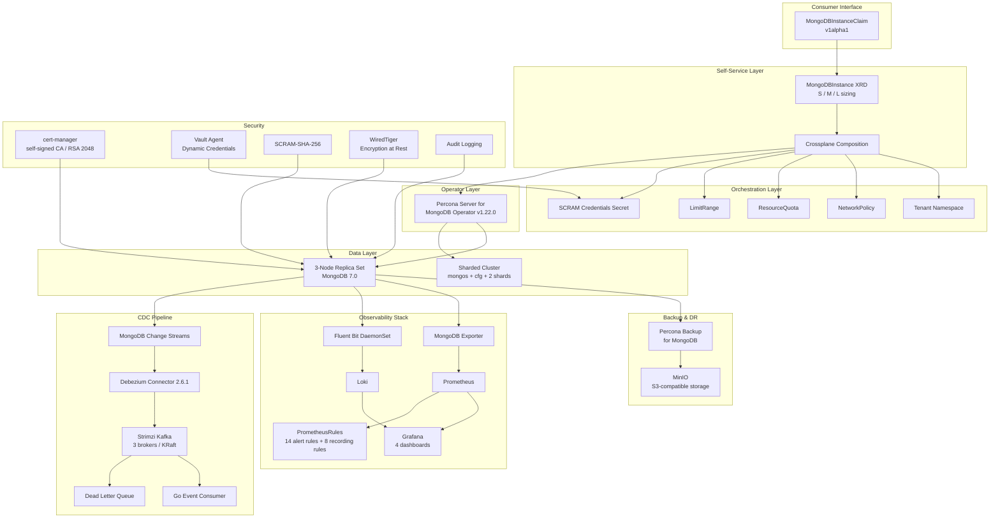

## Component Details

### Self-Service Layer

The self-service layer provides a Crossplane-based abstraction that allows product teams to provision MongoDB instances without knowledge of the underlying operator or infrastructure.

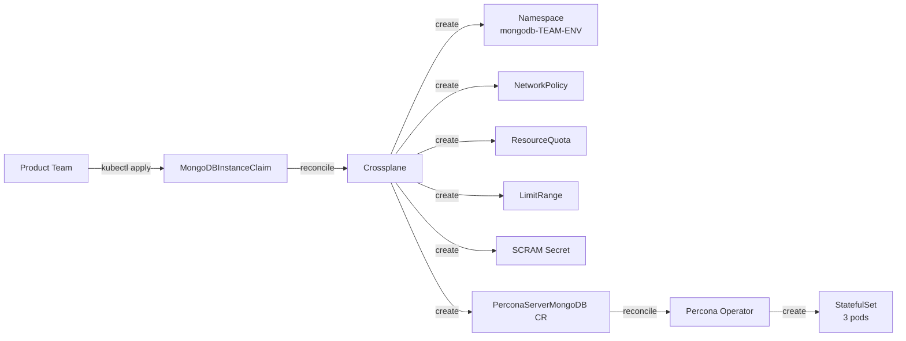

**XRD API surface** (`dbaas.platform.local/v1alpha1`):

| Parameter | Type | Required | Description |
|-----------|------|----------|-------------|
| `teamName` | string | Yes | Owning team (namespace prefix, RBAC, cost attribution) |
| `environment` | enum | Yes | `dev`, `staging`, `production` |
| `size` | enum | Yes | `S`, `M`, `L` (maps to resource profiles) |
| `version` | enum | No | MongoDB version (`6.0`, `7.0`). Default: `7.0` |
| `backupEnabled` | bool | No | Enable PBM backups. Default: `true` |
| `monitoringEnabled` | bool | No | Enable mongodb-exporter. Default: `true` |

**T-shirt size profiles**:

| Size | CPU req/lim | Memory req/lim | Storage | WiredTiger Cache |
|------|-------------|----------------|---------|------------------|
| S | 500m / 1 | 1Gi / 2Gi | 10Gi | 0.5 GB |
| M | 1 / 2 | 2Gi / 4Gi | 20Gi | 1.0 GB |
| L | 2 / 4 | 4Gi / 8Gi | 50Gi | 2.0 GB |

**Composition resources** (6 total per claim):

1. **Namespace** - `mongodb-{teamName}-{environment}`
2. **NetworkPolicy** - Intra-namespace + monitoring + operator + DNS egress
3. **ResourceQuota** - 2x instance profile to allow for upgrades and operator overhead
4. **LimitRange** - Default container limits scaled to size profile
5. **PerconaServerMongoDB CR** - 3-node replica set with size-appropriate resources
6. **SCRAM Secret** - Database admin credentials (placeholder, replaced by Vault in production)

Reference: [ADR-003](decisions/ADR-003-crossplane-vs-argocd-appset.md), [ADR-005](decisions/ADR-005-self-service-xrd-design.md)

---

### Operator Layer

The Percona Server for MongoDB Operator v1.22.0 manages the full lifecycle of MongoDB clusters:

- Automated replica set initialization and member management
- Rolling updates with `SmartUpdate` strategy
- Automated primary failover coordination
- User management via Kubernetes Secrets
- Storage provisioning via PVC templates

**Deployment model**:

- Installed via Helm (`percona/psmdb-operator` chart v1.22.0) in `mongodb-operator` namespace
- `watchAllNamespaces: true` for cluster-wide CR reconciliation
- CRDs installed separately (`percona/psmdb-operator-crds`)
- Non-root, read-only filesystem, all capabilities dropped

Reference: [ADR-001](decisions/ADR-001-percona-vs-community-operator.md)

---

### Data Layer

#### Replica Set Topology

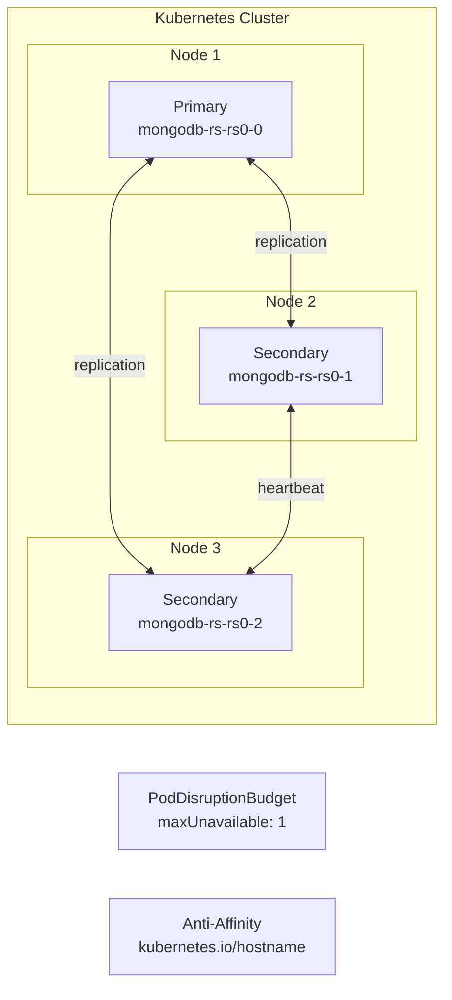

- 3 data-bearing members spread across nodes via pod anti-affinity
- PDB ensures at most 1 member unavailable during voluntary disruptions
- Write concern `majority` ensures durability on acknowledged writes
- WiredTiger engine with operation profiling for slow queries (>100ms)

#### Sharded Cluster Topology

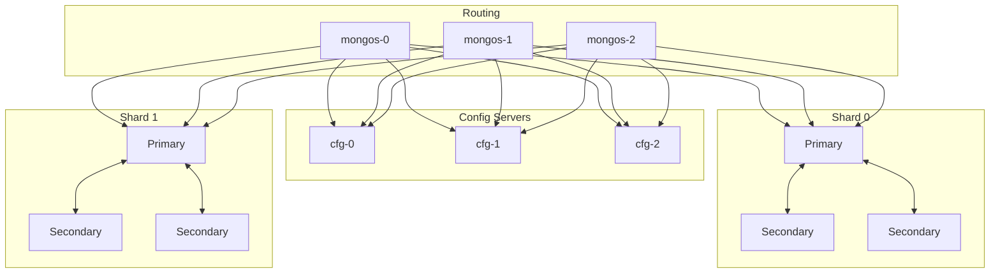

- 3 mongos routers for query distribution
- 3 config servers for metadata and chunk mapping
- 2 shards, each a 3-member replica set
- Total: 12 pods for a full sharded deployment

**Storage**:
- `StorageClass` with `WaitForFirstConsumer` binding (topology-aware scheduling)
- `Retain` reclaim policy to prevent accidental data loss
- Volume expansion enabled for online resize

Reference: [ADR-002](decisions/ADR-002-storage-class-selection.md)

---

### Backup and Disaster Recovery

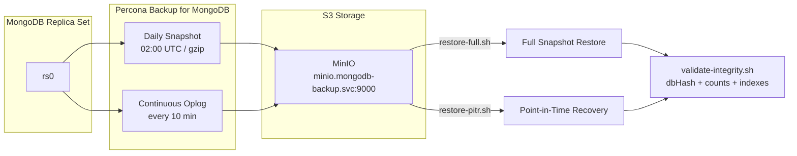

| Metric | Target | Implementation |
|--------|--------|----------------|
| **RPO** | 15 minutes | Continuous oplog backup every 10 minutes |
| **RTO** | 30 minutes | Automated restore scripts with validation |
| **Retention** | 7 days | Daily snapshots with gzip compression |

Restore procedures:
1. **Full restore** (`restore-full.sh`) - Restores the latest or specified snapshot
2. **PITR restore** (`restore-pitr.sh`) - Restores snapshot + replays oplog to target timestamp
3. **Integrity validation** (`validate-integrity.sh`) - Verifies `dbHash`, document counts, and index consistency

Reference: [ADR-004](decisions/ADR-004-backup-strategy-pbm.md)

---

### Observability Stack

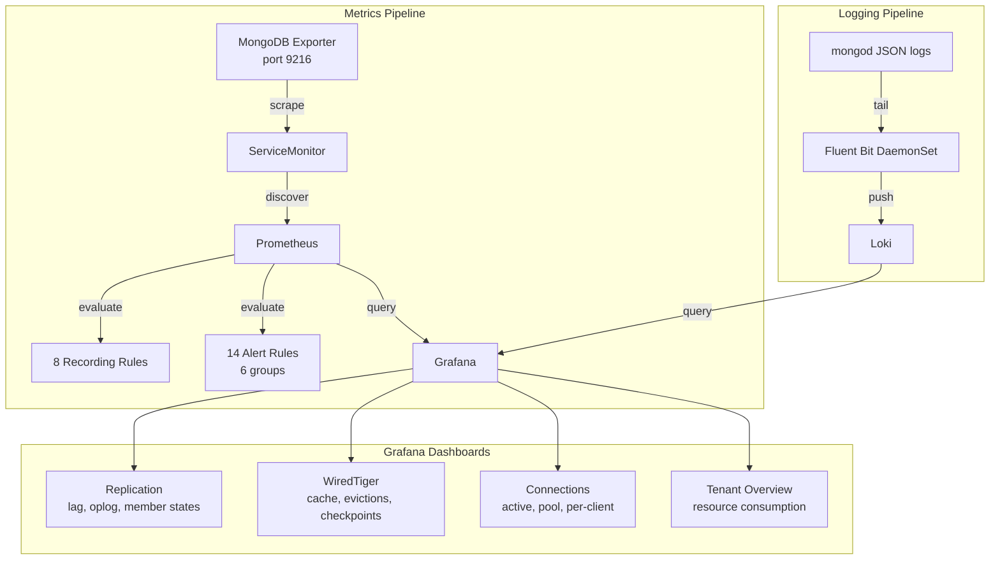

**Recording rules** (pre-computed metrics):
- `mongodb:replication_lag:seconds` - Lag between primary and secondary optime
- `mongodb:connections:utilization_ratio` - Current / available connections
- `mongodb:wiredtiger:cache_used_ratio` - Cache bytes in use / max configured
- `mongodb:opcounters:rate5m` - Operation rates (insert, query, update, delete, command)
- Plus 4 additional recording rules for dashboard efficiency

**Alert groups** (14 rules across 6 groups):

| Group | Alerts | Severity |
|-------|--------|----------|
| Availability | Primary not found, member down | Critical |
| Replication | Lag > 10s, oplog window < 2h | Warning / Critical |
| Resources | CPU > 80%, memory > 85% | Warning |
| Storage | Disk > 80%, disk > 90% | Warning / Critical |
| WiredTiger | Cache dirty > 20%, eviction stalls | Warning |
| Backup | Backup failed, backup age > 25h | Critical |

**Log correlation**: Loki datasource configured with derived fields for trace ID extraction, enabling metric-to-log correlation in Grafana.

---

### CDC Pipeline

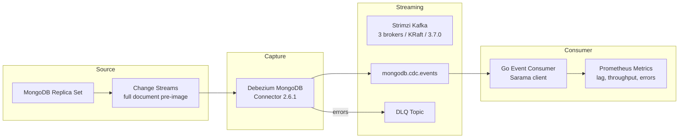

**Kafka cluster**:
- 3 brokers managed by Strimzi Operator
- KRaft mode (no ZooKeeper dependency)
- Kafka 3.7.0 with JMX Prometheus metrics
- Topic replication factor 3 for durability

**Debezium connector**:
- MongoDB connector v2.6.1
- Full document pre-image capture for complete change context
- Offset tracking for exactly-once delivery semantics
- Dead letter queue for poison messages

**Go event consumer**:
- Sarama Kafka client library
- Structured logging with `slog`
- Prometheus metrics: consumer lag, event throughput, processing errors, latency histogram
- Graceful shutdown with signal handling (SIGINT, SIGTERM)
- Multi-stage Docker build with distroless runtime image

Reference: [ADR-006](decisions/ADR-006-cdc-debezium-vs-change-streams.md)

---

### Security Architecture

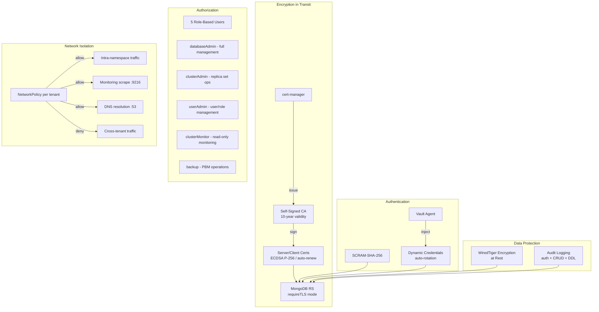

**Defense in depth layers**:

1. **Network** - NetworkPolicies enforce tenant isolation; only intra-namespace, monitoring, operator, and DNS traffic is allowed
2. **Transport** - TLS enforced on all replica set connections via cert-manager certificates
3. **Authentication** - SCRAM-SHA-256 with 5 role-based users; dynamic rotation via Vault
4. **Storage** - WiredTiger encryption at rest with key management
5. **Audit** - All authentication events, CRUD operations, and DDL changes are logged

---

### Multi-Tenancy Model

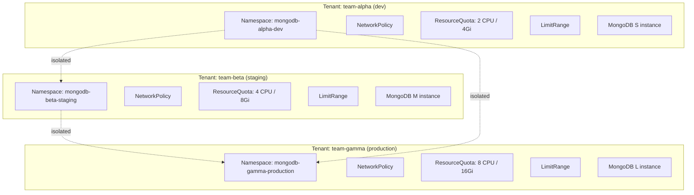

Each tenant receives:
- Dedicated namespace (`mongodb-{team}-{env}`)
- NetworkPolicy preventing cross-tenant communication
- ResourceQuota scaled to 2x the instance size profile (headroom for upgrades)
- LimitRange with defaults matching the size profile
- Independent SCRAM credentials

---

### CI/CD Pipeline

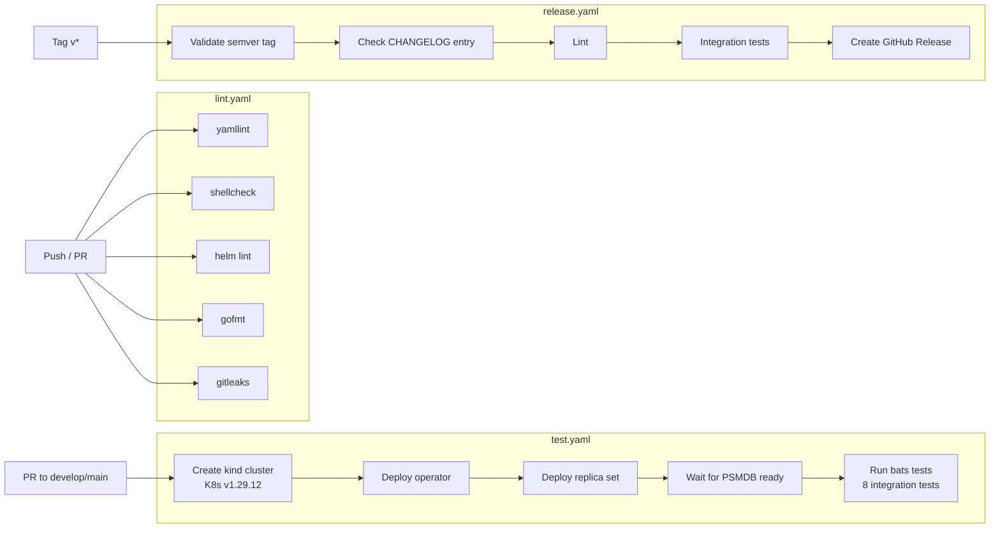

**Test coverage**:

| Test Suite | File | Tests | Coverage |
|-----------|------|-------|----------|
| Replica Set Health | `test_replicaset_health.bats` | 8 | Pod readiness, member count, primary election, replication lag, write concern |
| Sharding | `test_sharding.bats` | 10 | Mongos routing, config servers, shard topology |
| Backup/Restore | `test_backup_restore.bats` | 7 | Snapshot, PITR, integrity validation |
| Self-Service | `test_self_service.bats` | 15 | XRD provisioning, claim lifecycle, connection secrets |
| TLS | `test_tls.bats` | 12 | Certificate generation, TLS enforcement |
| Network Isolation | `test_network_isolation.bats` | 11 | Tenant isolation, cross-namespace denial |

**Chaos scenarios** (covered in [ADR-007](decisions/ADR-007-chaos-testing-approach.md)):

| Scenario | Script | Validates |
|----------|--------|-----------|
| Primary failure | `kill-primary.sh` | New primary elected <30s, no write loss, app reconnection <45s |
| Storage loss | `delete-pv.sh` | Backup-based recovery, data integrity post-restore |
| Network partition | `network-partition.sh` | Split-brain handling, partition healing, convergence |

---

## Cross-Project Integration Points

This platform is designed to integrate with a broader platform engineering portfolio:

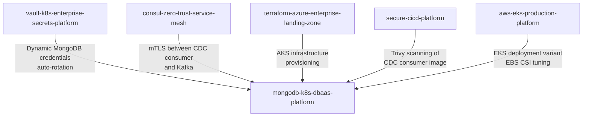

| Project | Integration |
|---------|-------------|
| `vault-k8s-enterprise-secrets-platform` | Vault Agent injects dynamic MongoDB credentials with TTL-based rotation |
| `consul-zero-trust-service-mesh` | mTLS between CDC consumer and Kafka brokers, service discovery |
| `terraform-azure-enterprise-landing-zone` | AKS infrastructure with managed disks optimized for MongoDB |
| `secure-cicd-platform` | Trivy vulnerability scanning and SBOM generation for CDC consumer image |
| `aws-eks-production-platform` | EKS deployment variant with EBS CSI driver and gp3 storage tuning |
